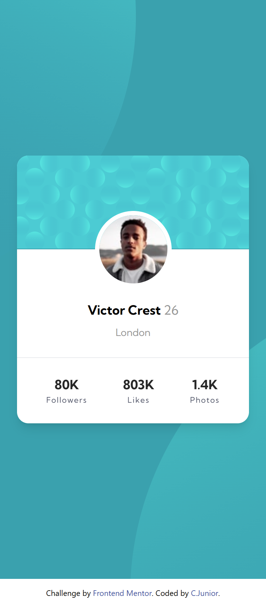
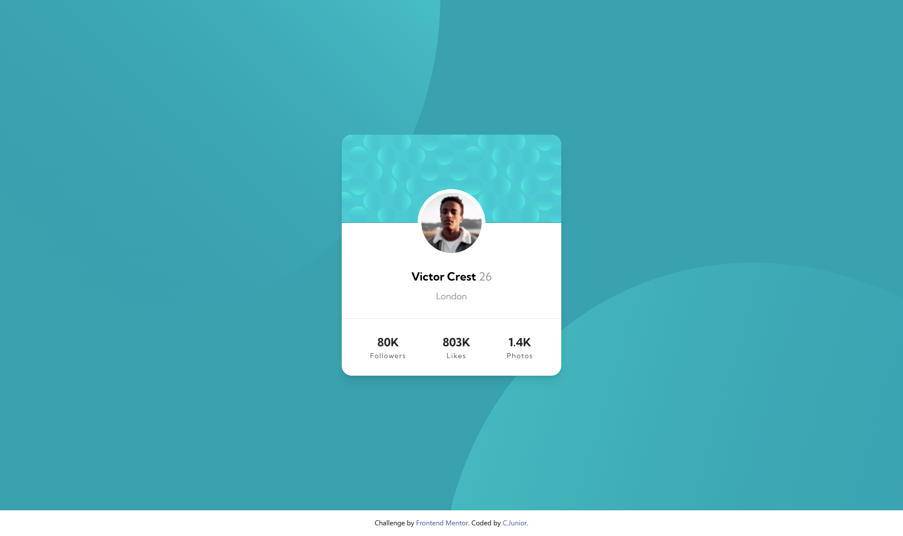

# Frontend Mentor - Profile card component solution

This is a solution to the [Profile card component challenge on Frontend Mentor](https://www.frontendmentor.io/challenges/profile-card-component-cfArpWshJ). Frontend Mentor challenges help you improve your coding skills by building realistic projects.

## Table of contents

-   [Overview](#overview)
    -   [The challenge](#the-challenge)
    -   [Screenshot](#screenshot)
    -   [Links](#links)
-   [My process](#my-process)
    -   [Built with](#built-with)
    -   [What I learned](#what-i-learned)
    -   [Continued development](#continued-development)
-   [Author](#author)

## Overview

### The challenge

-   Build out the project to the designs provided

### Screenshot

Mobile - 375px



Desktop - 1440px



### Links

-   Solution URL: [Github](https://github.com/Clar-Junior/profile-card-component-main)
-   Live Site URL: [Github Pages](https://clar-junior.github.io/profile-card-component-main/)

## My process

### Built with

-   Semantic HTML5 markup
-   Flexbox
-   CSS Grid
-   Mobile-first workflow
-   [Tailwind](https://tailwindcss.com/) - A utility-first CSS framework

### What I learned

I've learned a little more about resposivity using Tailwindcss on different screens sizes.

```html
<div class="w-full h-1/2 min-md:h-screen min-lg:w-full min-lg:h-full overflow-hidden max-md:flex max-md:items-end max-md:justify-end border-0">
	<div class=" w-full h-full overflow-hidden">
		
	</div>
</div>
```

```css
@theme {
	--color-dark-cyan: hsl(185, 75%, 39%);
	--color-very-dark-desaturated-blue: hsl(229, 23%, 23%);
	--color-dark-grayish-blue: hsl(227, 10%, 46%);
	--color-dark-gray: hsl(0, 0%, 59%);
	--font-kumbh-sans: "Kumbh_Sans";
	--color-dark-blue: hsl(228, 45%, 44%);
}

.fontBold {
	@apply font-bold text-[18px];
}
```

### Continued development

I'll go on studying about Tailwind and how use it efficiently.

## Author

-   Github - [CJunior](https://github.com/Clar-Junior)
-   Frontend Mentor - [@Clar-Junior](https://www.frontendmentor.io/profile/Clar-Junior
